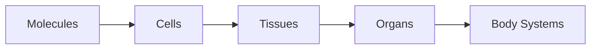

# Lecture 1 Introduction

##### Learning Outcomes
- Define what physiology is and how this differs from anatomy, using examples
- List the different levels of organisation within the human body, describing how they integrate
- Describe the importance of homeostasis within the body and how the body responds to changes in setpoints

##### Defining Physiology
Physiology is the study of how structures in the body relate to one another.

##### Difference between Physiology and Anatomy
| |Physiology|Anatomy|
|:--|:--|:--|
|Definition|Study of relationship between structures inside the boy|Study of structures in the body|
|Example| 1. How a muscle contracts   2. How the stomach digests food| 1. The structure of the muscle   2. The types of tissues present in the stomach|

##### Levels of Organisation

##### How the Levels of Organisation Integrate
Integration of the levels of organisation occur because each level relies on the functions of the preceding level. For example, molecules are the base components of basic chemical building blocks such as proteins, carbohydrates, lipids and DNA structures. Additionally, molcules come together to form cells, and cells use these basic chemical building blocks, especially DNA structures, to perform complex processes.

##### Types of Tissues
1. Epethelial
	- Protection
	- Secretion
	- Absorption
2. Connective
	- Structural Support
3. Muscle
	- Movement
4. Nervous
	- Communication
	- Co-ordination
	- Control
##### Body Systems
1. Integumentary System
2. Digestive System
3. Immune System
4. Endocrine System
5. Respiratory System
6. Reproductive System
7. Musculo-Skeletal System
8. Cardiovascular System
9. Renal System
10. Central Nervous System

##### Importance of Homeostasis
Homeostasis is important because it acts as a dynamic equilibrium that allows for an organism to thrive despite a constantly changing external environment.

##### How the Body Responds to Changes in Setpoints
The body responds to changes via feedback loops, involving sensors, effectors and control centers. More specifically, negative feedback loops reverse deviations from a setpoint and maintain stability.

##### Terminology
* Long Distance Reflex
	* Example
		* Skin has issue
		* Signal is sent to brain
		* Brain sends response
		* Response occurs
* Local Reflex
	* Occurs within tissues
	* Example:
		* You run
		* Your legs muscles will have higher activity than normal
		* Oxygen level decreases in that area of the body
		* to increase oxygen content, there is an increased blood flow
- Interstitial Fluid
	- A subset of extracellular fluid
	- Fluid that surrounds and bathes the cells in tissues
- Extracellular Fluid
	- Fluid between cells
- Intracellular Fluid
	- Fluid within a cell
