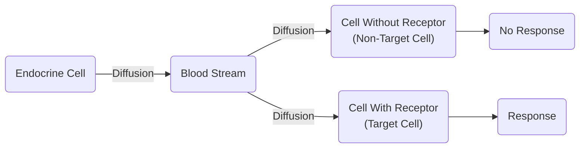
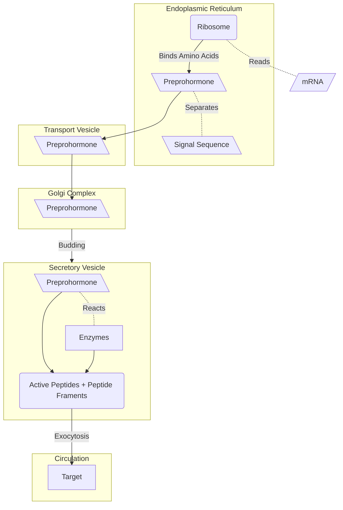
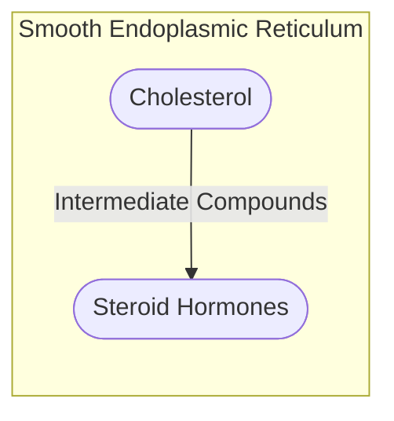
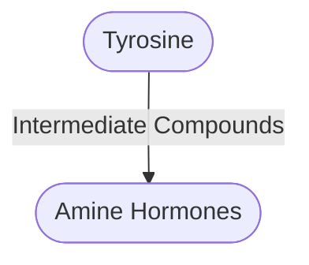
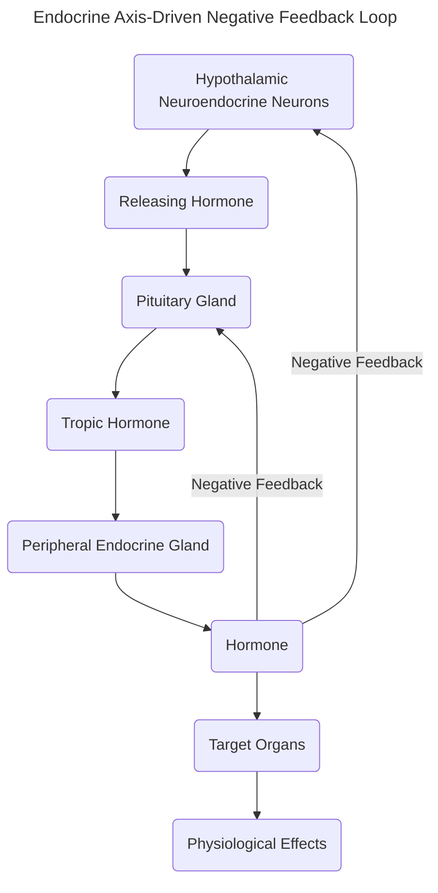

# Lecture 2 Endocrine System

#### Learning Outcomes

- Describe the role of the endocrine system
- Identify the cells of the endocrine system and their location
- Understand the regulation of hormone action (secretion, signalling, termination and feedback loops)
- List the classes of hormones and modes of action
- Describe how different endocrine pathologies occur

##### Endocrine System
The endocrine system is one of the key ways a cells communicate with each other. This is achieved through the secretion of hormones.

In simpler terms, one of the ways cells can "talk" to each other is through the use of hormones (like emails). Hormones travel through the blood circulation (the internet) to reach the specific target(s) (the recipient). The endocrine system (the email server) is what allows this to happen.

##### Functions of the Endorine System
The endocrine system is reponsible for many things in the body. This is a generalized list of some, but not all of the functions of the endocrine system.
- Respiration
- Metabolism
- Reproduction
- Sensory Perception
- Movement
- Sexual Development
- Growth

##### Glands of the Endocrine System and Their Location
- Pituitary Gland
	- Located in the Head
- Thyroid
	- Located near the Throat
- Parathyroid
	- Located near the Throat
- Islets of Langerhans
	- Located near the Pancreas
- Adrenal Gland
	- Located near the Kidneys
- Ovaries
	- Located near the Groin
- Testes
	- Located near the Groin

##### Hormones
Hormones are chemical messengers that are made in one part of the body and are sent through blood circulation to reach specific targets, triggering effects in the corresponding body parts.

##### Hormone Action (What Hormones Can Make a Cell Do)
Hormones act on target cells in 1 of 3 ways (The resultant effect of how hormones can affect cells):
1. Control the rate of enzymatic reactions
2. Control ion and molecular transport across cell membranes
3. Control gene expression and protein synthesis

The mode of action of hormones is as follows (How hormones affect cells):
1. Hormones are secreted into extracellular space (or blood stream depending on the hormone pathway) and transported to the target cell.
2. All hormones must bind to their target cell receptor
3. Response occurs depending on target receptor and associated signal transduction pathways
4. Hormones are all degraded

##### Regulation of Hormone Action

Simply put, the hormones diffuse into the vasculature (blood stream) and travel to the intended site. The hormones then diffuse out of the vasculature when they have reached the site and bind to specific receptors of the intended cells of the target organ.

##### Types of Hormone Pathways (Signalling)
1. Autocrine Pathway (Autocrine Signalling)
	- Hormones target sites on the same cell that produced them
	- Influences the function or activity of the secreting cells themselves
	- Cell releases hormones and the hormones attach to itself (E.g. opening a bottle of bees and the bees attack you)
2. Paracrine Pathway (Paracrine Signalling)
	- Hormones act on nearby cells without entering blood circulation
	- Affects adjacent cells within the same tissue
	- Cells release hormones and the hormones attach themselves to neighbouring cells (E.g. opening a bottle of bees and the bees attack the friend next to you)
3. Endocrine Pathway (Endocrine Signalling)
	- Hormones are released directly into the bloodstream by the endocrine glands
	- Travels to distant target cells or organs
	- Cells release hormones and the hormones diffuse into the bloodstream to affect their target cells (E.g. opening a bottle of bees and the bees travel down the road to harrass another person)

##### Hormone Production (Secretion)
###### Production (Secretion) of Peptide Hormones

###### Production (Secretion) of Steroid Hormones
Synthesized in the Smooth Endoplasmic Reticulum

###### Production (Secretion) of Amine Hormones
Similar to Steroid Hormones, they are derived from Tyrosine instead of cholesterol

##### Termination of Hormone Action
Hormone action is terminated through 1 of 3 ways.
1. Limiting the secretion of hormones
	- Feedback Loops
		- Most hormones are regulated via Negative Feedback Loops
		- Very few hormones are regulated via Positive Feedback Loops
2. Removing or inactivating the hormone in circulation
	- Hormones are degraded by enzymes
		- These enzymes are generally produced in the liver or kidney
3. Terminating hormone activity in target cells
	- Receptor-hormone complex is brought into the target cell via endocytosis and causes the hormones to be digested by lysosomes

##### Feedback Loops
- Negative Feedback Loops
	- A hormone act to induce a change (increase or decrease circulating levels of a specific component)
	- The change occurs
	- Due to this change, the secretion of the specified hormone is inhibited
	- Like a sine graph the concentration of the hormone goes up and down in waves
- Positive Feedback Loops
	- A hormone increases or decreases levels of a specific component
	- This causes a stimulation of more of the hormone to be secreted
	- Like an exponential graph, the concentration of the hormone keeps increasing

##### Endocrine Axis-Driven Negative Feedback Loop
Simply put, the hypothalamus releases a hormone, called HRH, that activate the pituitary gland, which then releases a tropic hormone, which then activtes the peripheral endocrine gland, which, in turn, releases a peripherally produced hormone which inhibits HRH and tropic hormone production. While the inihibition is occuring, the leftover HRH and tropic hormones act on the target organs ad trigger a physiological effect.

##### Hormone Classification
###### Classification by Function
When classifying by function, hormones can be split into two types:
1. Tropic Hormones
	- Hormones that regulate the production and secretion of anoter hormone
		- E.g. Thyroid Stimulating Hormone (TSH), secreted by the anterior pituitary and stimulates the thyroid gland to secreted thyroid hormones
2. Non-Tropic Hormones
	- Thyroid Hormones increase metabolic rate of cells

###### Classificaion by Solubility
Similarly, hormones are only hydrophillic or lipophillic.
- Peptide and Amine Hormones are Hydrophillic (Can dissolve in water)
- Steroid Hormones are Lipophillic (Can dissovlvein lipids)

###### Classification by BioChemistry
Hormones are mostly classified using biochemistry, and there are divided as:
1. Peptide Hormones (Also called protein hormones)
	- Composed of linked amino acids
2. Steroid Hormones
	- Derived from cholesterol
	- Synthesized only in few organs:
		- Adrenal Cortex
		- Gonads
		- Skin
		- Placenta
3. Amine Hormones 
	- Modified from tryptophan or tyrosine

##### Hormone Mechanism of Action (How Hormones Manipulate a Cell)
- Peptide and Amine Hormones must combine with a memebrane receptor of their target cell to instigate a response 
	- This is because they are hydrophillic and cannot direcly pass through cell membrane
- Steroid Hormones are lipophillic and can diffuse easily across membranes
	- This means they can directly enter a cell and instigate a response
	- Steroid secreting cells cannot store these hormones in their secretory vesicles
	- Usually bound to carrier proteins to prevent enzymatic degredation
	- Carrier proteins act like a taxi, they remain outside the cell
	- Move directly to their respective receptors and binds to orm a receptor-hormone complex
	- Receptor-hormone complex binds to DNA to nstigate a response
	- However, they are:
		- NOT SOLUBLE in blood
		- Synthesized as needed
		- Transported via concentration gradient by diffusion

##### Endocrine Pathologies (Examples and Causes)
There are three classes of Endocrine Pathology
1. Hypersecretion
	- Excess levels of Hormones
	- Can be caused by:
		- Benign Tumors 
		- Canerous Tumors
		- Outside Influence
2. Hyposecretion
	- Deficiency of Hormones
	- Can be caused by:
		- Genetics
		- Diet Deficiencies
		- Immuniological Issues
		- Removal of Gland/Tissue (Surgery or Otherwise)
3. Abnormal Responsiveness of Target Tissues
	- Can cause Down-Regulation
		- If hormone levels are too high for extended periods of time, the target cells can down-regulate their receptors.
			- This slows are stops the responsiveness of the cell to the specific hormone
		- E.g. Hyperinsulinemia (Also called Type 2 Diabetes)