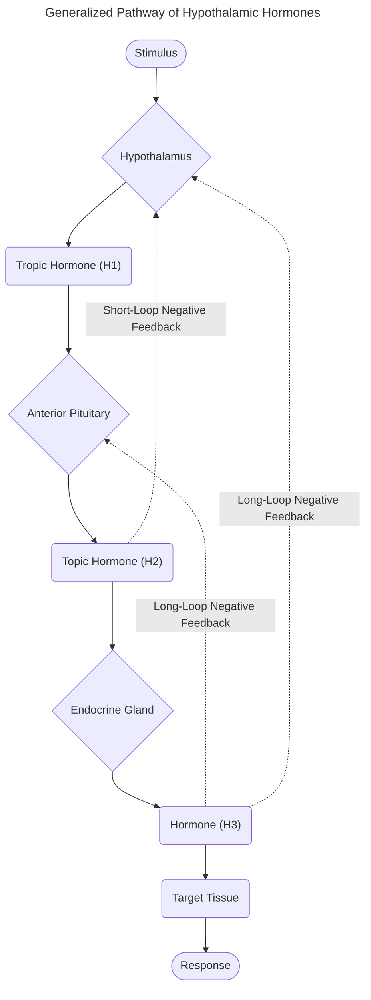
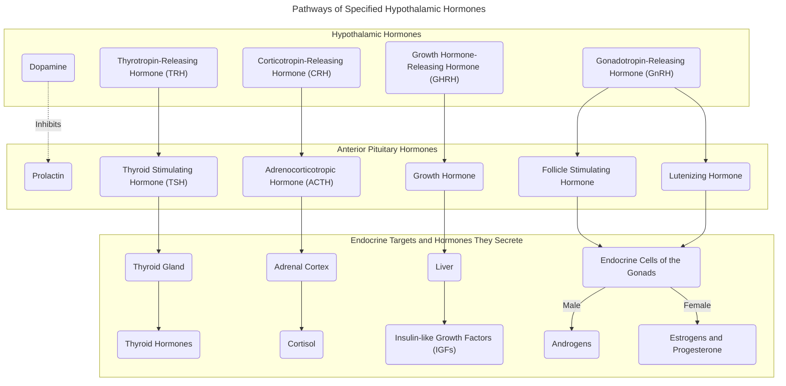
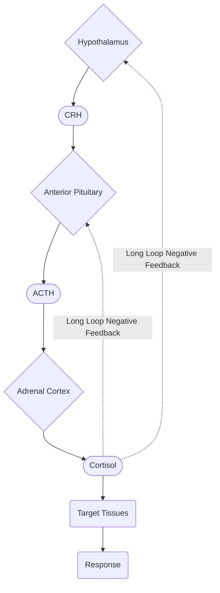
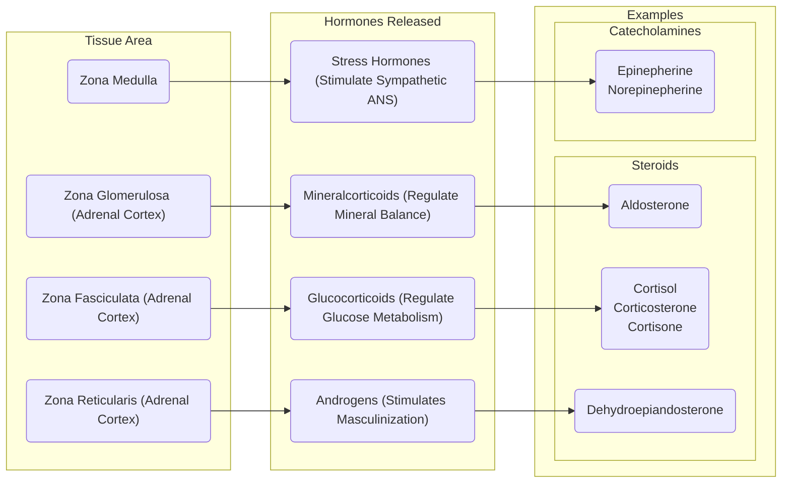

# Lecture 3 Introduction to the HPA Pathway

#### Learning Outcomes

- List the central endocrine glands including:
    - Hypothalamus and hypothalamic hormones
    - Pituitary gland
    - Posterior pituitary and posterior pituitary hormones
    - Anterior pituitary and anterior pituitary hormones
- Describe the HPA pathway and the associated hormones
- Explain the function of the adrenal gland and the adrenal hormones
- Understand the actions of cortisol and abnormal cortisol secretion

#### Central Endocrine Glands
There are three central endocrine glands:
- Hypothalamus
- Pituitary Gland
- Pineal Gland

Note that the Pineal Gland is not a main topic, and we need to know is that it releases Melatonin.

#### Hypothalamic Hormones
Hypothalamic Hormones are tropic hormones (also called Releasing Hormones) released by the hypothalamus. The list of Hypothalamic Hormones are as follows:
- Thyrotropin-Releasing Hormone (TRH)
- Dopamine
- Growth Hormone-Releaisng Hormone (GHRH)
- Somatostatin
- Gonadotropin-Releasing Hormone (GnRH)
- Corticotropin-Releasing Hormone (CRH)
- Oxytocin
- Vasopressin

Hypothalamic Hormones follow a generalized pathway.

Below is a more detailed flowchart showing the different pathways of specific Hypothalamic Hormones.

#### Pituitary Gland Anatomy and Hormones
The Pituitary Gland is split into two parts:
- Posterior Pituitary
    - It is an extension of neuronal tissues and is directly connected to the Hypothalamus
        - It is technically an extension of the hypothalamus
    - Only secretes hormones made by the Hypothalamus
    - Cannot be considered an endocrine organ on its own
    - The hormones releaseed are:
        - Vasopressin
        - Oxytocin
        - Anti-Diuretic Hormone

- Anterior Pituitary
    - Synthesizes and releases its own hormones
    - Directly regulated by the Hypothalamus
    - Can be considered a "True" endocrine gland
    - The hormones released are:
        - Growth Hormone
        - Thyroid Stimulating Hormone (TSH)
        - Adrenocorticotropic Hormone (ACTH)
        - Follicle-Stimulating Hormone (FSH)
        - Lutenizing Hormone (LH)
        - Prolactin

#### Hypothalamic Pituitary Adrenal Axis
The Hypothalamic Pituitary Adrenal Axis (HPA Axis) is a term used to represent the interaction between the Hypothalamus, Pituitary Gland and Adrenal Gland. This pathway is the key to our body's response to stress because it is the initiation of this pathway that allows for the release of cortisol from the adrenal cortex. The result of the release of cortisol provides energy in the form of glucose for the body to deal with the stressor.

The Hormones associated with the HPA Axis are:
- Corticotropin-Releasing Hormone (CRH)
- Adrenocorticotropic Hormones (ACTH)
- Cortisol

In simpler terms, it is important to cause the HPA Axis to activate in times of stress because one of the outputs of this pathway is glucose (which provides energy for the body to deal with the stressor). The HPA Axis can be generalized to the following flowchart:

Note that Cortisol has a strong negative feedback effect on the Anterior Pituitary to inhibit the secretion of ACTH.

#### Function of the Adrenal Gland and its Associated Hormones
The Adrenal Gland is made up of two parts:
- (Outer) Cortex
- (Inner) Medulla

While the Cortex is the largest part of the adrenal gland, it is also made up of three smaller parts that release their respective hormones:
- Zona Glomerulosa
- Zona Fasciculata
- Zona Reticularis

#### Actions of Cortisol
Cortisol is a hormone that is controlled by the Hypothalamus and Pituitary Gland. It has many effects on the human body. The generalized list is as follows:
- Increasing Effects:
    - Increased Appetite
    - Increase Blood Pressure
    - Increased Insulin Resistance
    - Increased Gluconeogenesis (Production of Glucose)
        - Increased Blood Sugar
        - Increased Blood Pressure
    - Increased Lipolysis (Breakdown of fats)
- Decreasing Effects:
    - Decreased Wound Healing
    - Decreased Inflammatory Activity
    - Decreased Bone Formation
    - Decreased Allergic Reactions
    - Decreased Inflammatory Response
    - Decreased Pain Sensation
    - Decreased Digestion
- Other Effects:
    - Raises or Lowers the mood depending on the situation
    - Inhibitory effect on the Immune System

#### Abnormal Cortisol Secretion
There are only two types of Abnormal Cortisol Secretion, having too much or too little cortisol.
- Hyper-Cortisolism (Too much Cortisol)
    - Cushing's Syndrome
        - Constantly Elevated Cortisol Levels
        - Severe Muscle, Bone and Skin Breakdown
        - Weight Gain
        - Glucose Intolerance
        - Increased Risk of Infection
        - Slow Healing of Cuts
        - Fatigue
- Hypo-Cortisolism (Too little Cortisol)
    - Less common
    - Addison's Disease
        - Extreme tiredness
        - Weak muscles
        - Reduced appetite
        - Weight loss

