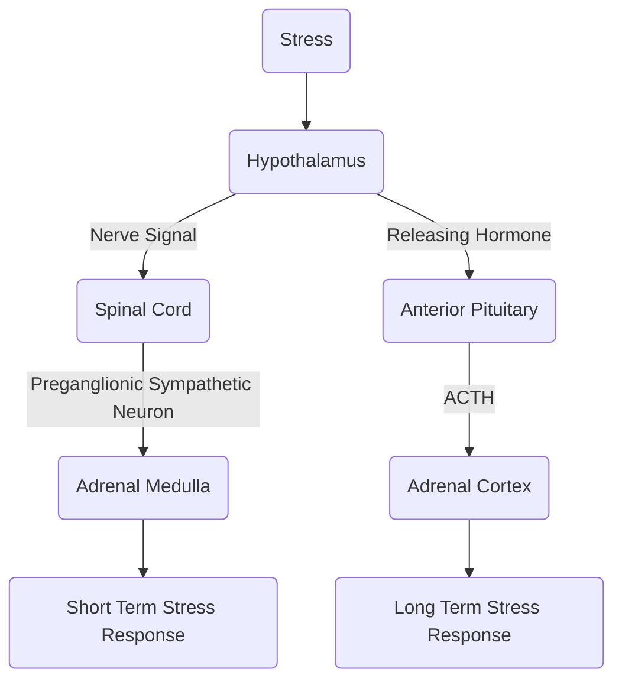
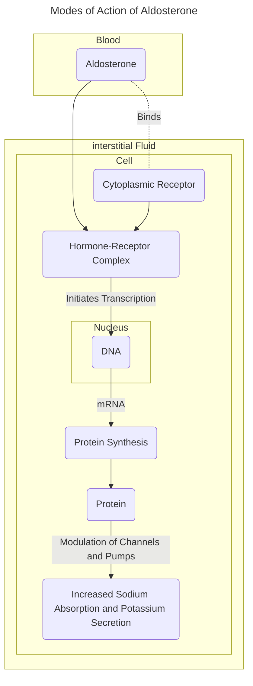
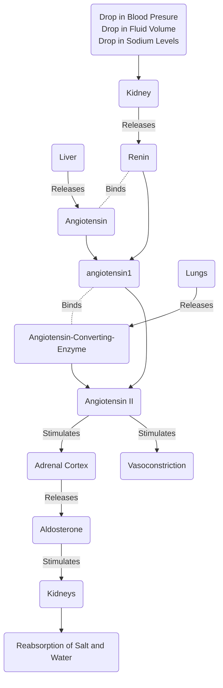
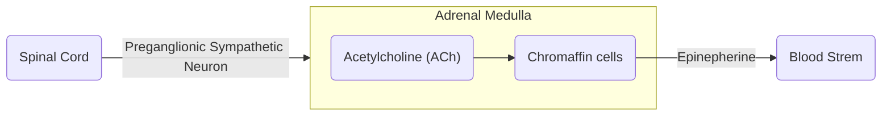

# Lecture 4 Adrenal Function

#### Learning Objectives
- Understand adrenal function and the anatomy of the adrenal glands
- Describe the function of the adrenal cortex and the role of the 3 layers
- List the hormones secreted from the adrenal cortex
- Describe the physiological actions of mineralocorticoids (aldosterone)
- Explain the Renin-angiotensin-aldosterone system functions
- Describe the hormones secreted from the adrenal medulla
- Explain the actions of adrenaline and noradrenaline
- Explain the function of the adrenal androgens

#### Anatomical Structure of the Adrenal Gland
The adrenal gland is 'split' into two main parts, the Adrenal Cortex and teh Adrenal Medulla. The Adrenal Cortex is further 'split' into 4 regions. The anatomy of the adrenal glands is as follows, starting from the surface, working towards the center:
- Adrenal Cortex
    - Capsule
    - Zona Glomerulosa
    - Zona Fasiculata
    - Zona Reticularis
- Adrenal Medulla

##### Function of the Adrenal Gland
The function of the adrenal gland itself is to maintain homeostasis of the body. More specifically:
- Adrenal Cortex (Responsible for the body's response to 'long-term' stress)
    - Capsule
        - Provides Structural Support and Protection to the Adrenal Gland
    - Zona Glomerulosa
        - Maintains Water and Electrolyte Homeostasis
    - Zona Fasiculata
        - Regulates [Glucose Metabolism](Lecture_3_Introduction_to_the_HPA_Pathway.md) (Covered in Lecture 3)
    - Zona Reticularis
        - Development and Maintenance of Secondary Sexual Characteristics
- Adrenal Medulla
    - Responsible for the body's response to 'acute' or 'short-term' stress

The main hormones secreted by the adrenal glands are:
- Steroid Hormones
    - Glucocorticoids
    - Mineralcorticoids
    - Progesterone
    - Androgens
    - Estrogens
- Amine-Derived Hormones
    - Catechoamines
    - Epinepherine (Adrenaline)
    - Norepinepherine (Noradrenaline)

#### Physiological Actions of Mineralocorticoids (Aldosterone)
The **Zona Glomerulosa** secretes **Mineralcorticoids**. The principle mineralcorticoids secreted by the Zona Glomerulosa is **Aldosterone**.

###### Renin-Angiotensin-Aldosterone System (RAAS)
Thee RAAS functions to elevate blood pressure and maintain fluid and electrolyte balance (in the short term) in response to conditions such as low blood pressure or dehydration.

#### Effects of Adrenal Androgens
Adrenal Androgens are secreted from the **Zona Reticularis** (Not to be confused with 'normal' androgens secreted by the testes and ovaries). Note that the Zona Reticularis does secrete other sex steroids, primarily Dehydroepiandosterone (DHEA).

While Adrenal Androgens have a minimal stress response, and weak adrenergic activity, it does provide a pool of circulating precursors for peripheral conversions into potent androgens (Testosterone and Estrogen).

In Males:
    - Promotes prostate growth
    - Development of masculinization
    - lIncreases Libido
In Females:
    - Promotes hair growth
    - Increased Sebum production
    - Increased Libido

#### Anatomical Structure of the Adrenal Medulla
- The neuronal cells that make up the adrenal medulla are called chromaffin cells
- Chromaffin cells make neurohormones and are found in the adrenal clands and in groups of nerves called ganglia

##### Function of the Adrenal Medulla
The main role of the Adrenal Medulla is to initiate a response to 'acute' or 'short-term' stress. In other words, it is responsible for the 'fight or flight' response.
- Secretes Catecholamines
    - [Amine Hormones](Lecture_3_Introduction_to_the_HPA_Pathway.md)
    - Adrenaline
    - Noradrealine
    - Dopamine

##### Effets of Epinepherine and Norepinepherine
1. Glycogen Breakdown:
    - Epinephrine: Stimulates the breakdown of glycogen into glucose, providing a rapid energy source.
    - Norepinephrine: Also contributes to glycogen breakdown, supporting increased energy availability.
2. Increase in Blood Pressure:
    - Epinephrine: Induces vasoconstriction, raising blood pressure by narrowing blood vessels.
    - Norepinephrine: Has vasoconstrictive effects, contributing to increased blood pressure.
3. Increased Breathing Rate:
    - Epinephrine and Norepinephrine: Signal respiratory centers, leading to an elevated breathing rate for enhanced oxygen intake.
4. Increased Metabolic Rate:
    - Epinephrine and Norepinephrine: Accelerate overall metabolic processes, supporting increased energy production and utilization.
5. Change in Blood Flow Patterns:
    - Epinephrine and Norepinephrine: Alter blood flow distribution, directing it toward vital organs (brain, muscles) to increase alertness while reducing non-essential functions like digestion and kidney activity.

