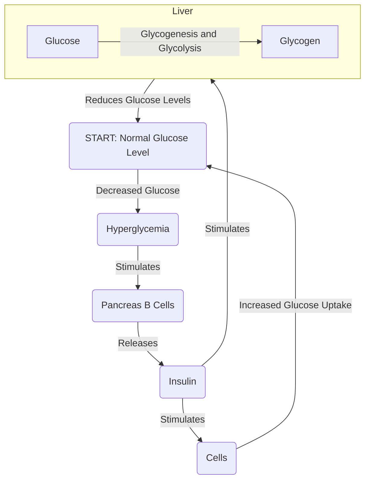
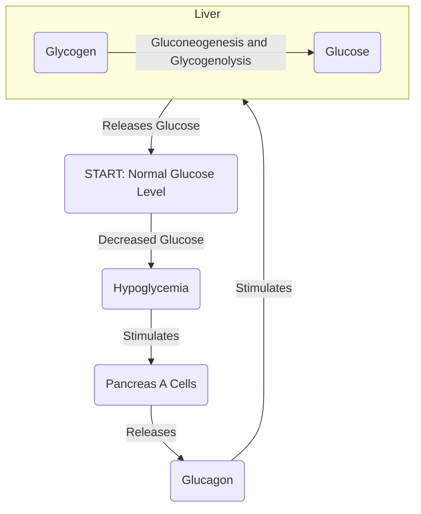
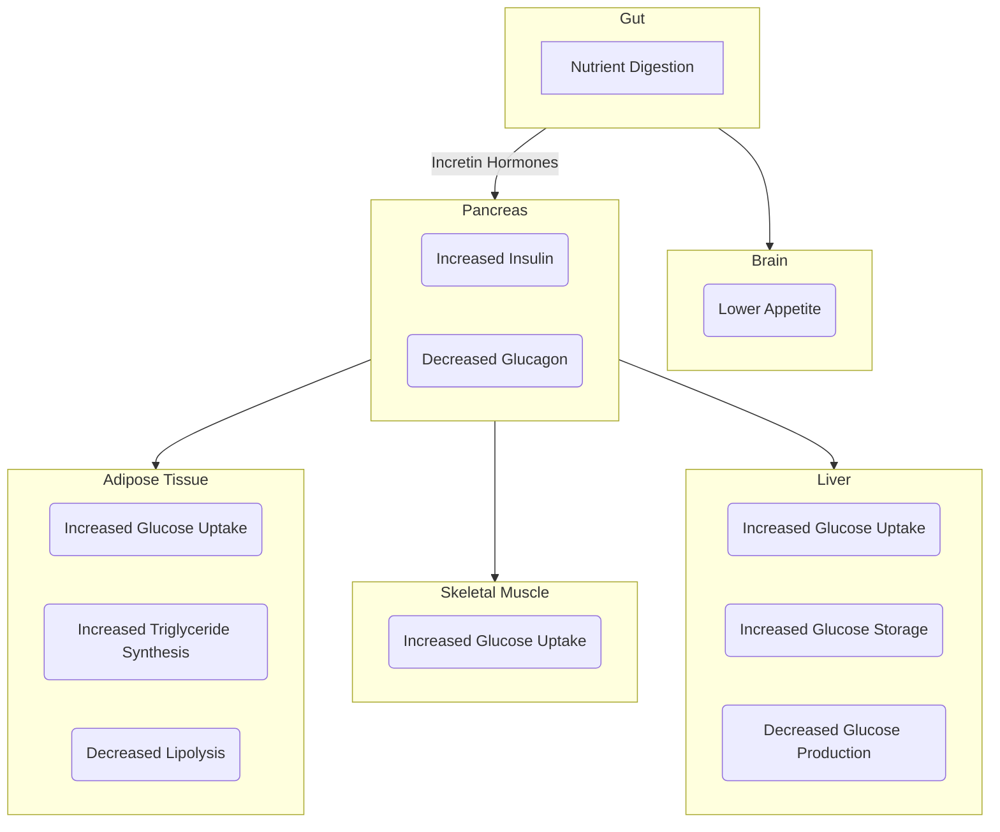

# Lecture 6 Glucose Homeostasis

#### Learning Outcomes
- To outline sources of glucose for the circulation from various stores
- To describe the mechanisms of glucose uptake from the circulation.
- To describe the regulation of insulin secretion.
- To describe the regulation of glucagon secretion
- To explain how insulin and glucagon act to regulate glucose levels
- To explain the deleterious effects of hypoglycaemia
- To explain the deleterious effects of hyperglycaemia
- To distinguish the difference between Type 1 and Type 2 diabetes

#### Sources of Glucose
Glucose is a simple sugar is is used as 'fuel' for the body. Common sources in the body include:
- Absorption from intestines
- Breakdown of Glycogen to Glucose (via Glucagon + Glycogenolysis)
- Synthesis of Glucose from Non-Carbohydrate Sources (Glucagon + Gluconeogenesis)
- Hyperglycemic Hormones
    - Glucagon
    - Steroids
    - GH
    - Thyroid Hormones

Similarly, common uses of glucose in the body is as follows:
- Utilization by tissues for energy
- Glycogen Synthesis
- Storage of Glucose as Fat or Glycogen
- Hypoglycemic Hormones
    - Insulin

#### Mechanisms of Glucose Uptake
For a cell to increase its glucose uptake, it generally follows te following 'procedure':
1. Insulin released by te pancreas binds to its respective receptor on the cell.
2. The binding of insulin activates a cascading signalling pathway
3. The cascading signalling pathway activates GLUT4 Transporter Translocation
4. This leads to an increase in glucose uptake

Simply put, Insulin will bind to a receptor and activate a signalling cascade (Where one signal causes another to be produced and another signal is produced and so on until the end of the 'cascade'). This signalling cascade would then cause the GLUT4 transporters, which were originally not on the cell membrane, to be moved to the cell membrane. Thus, like chemistry, with a higher surface area, the faster the reaction, or in this case, uptake of glucose.

#### Regulation of Insulin
Insulin is one of the most well known hormones, and its primary function is to increase the glucose uptake of cells while also being responsible for directly transforming **Glucose into Glycogen** (Glycogenesis).

When the body consumes nutrients, there is an increase in glucose levels in the body. This induces a very weak form of hyperglycemia, which stimulates pancreatic beta cells to secrete Insulin. Insulin then takes 1 of 2 main actions. 1 being the binding to cell receptors, which activate the receptors and activates a signalling cascade, basically causing the cell to increase its glucose uptake. 2 being its travelling to the liver and aiding in transforming Glucose into Glycogen via Glycogenesis and Glycolysis. Thus returning the blood glucose level back to its original state and regulating the secretion of Insulin.

#### Regulation of Glucagon
Glucagon is a hormone that primary function is to break **Glycogen into Glucose**. It aids in maintaining the glucose levels in the body.

When the body does a certain action, there is a decreased in glucose levels in the body. This induces a very weak form of hypoglycemia, which stimulates pancreatic alpha cells to secrete Glucagon. The Glucagon then enters the liver to break Glycogen into Glucose and to produce Glucose from Non-Carbohydrate sources(via Gluconeogenesis and Glycogenolysis). Thus, returning the Blood Glucose Level to its original state and regulating the secretion of Glucagon.

#### Regulation of Glucose Levels

Organ relationship for glucose levels

#### Effects of Hypoglycemia
Symptoms/Consequences:
- Hunger
- Paleness
- Sweating
- Shaking/Trembling
- Weakness
- Headache/Dizziness
- Slurred Speech
- Lack of Concentration

#### Effects of Hyperglycemia
Symptoms/Consequences:
- Excessively thirst
- Frequent passing large volumes of urine
- Blurred vision
- Weight loss
- Feeling tired
- Diabetes Complications

#### Difference Between Type 1 and Type 2 Diabetes

Type 1 diabetes is a form of diabetes where there is an absolute absence of insulin. This disease is one that a person is born with, or can develop naturally unlike Type 2.

Type 2 diabetes can be caused by lifestyle choices, causing a relative deficiency of insulin. Simply put, there is a defect in insulin action (and secretion).
