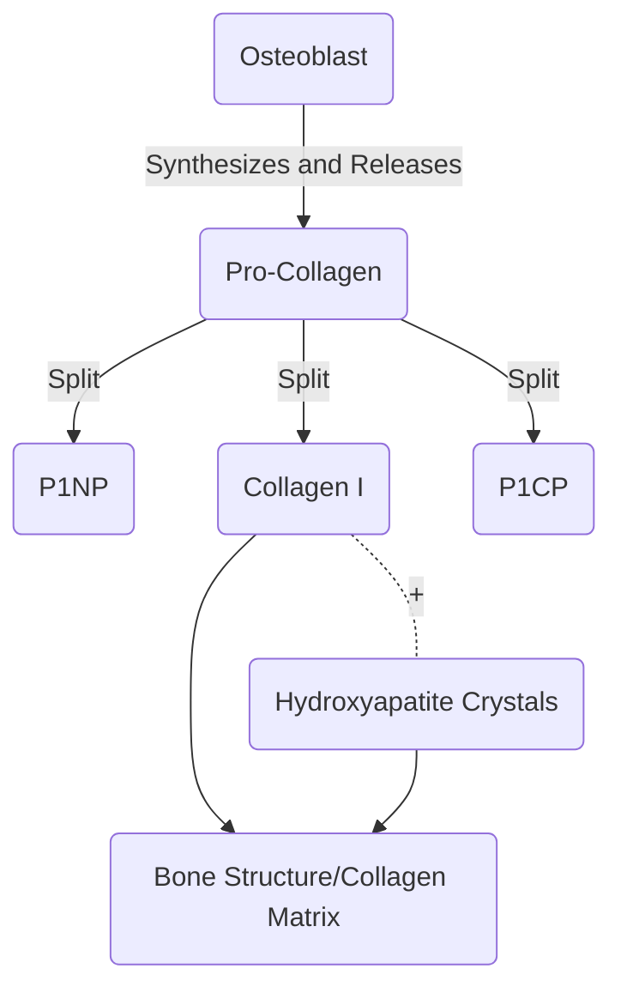
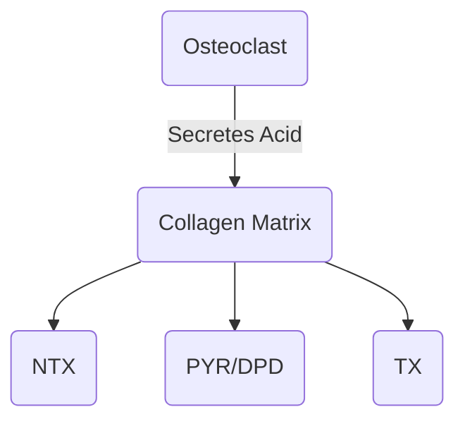
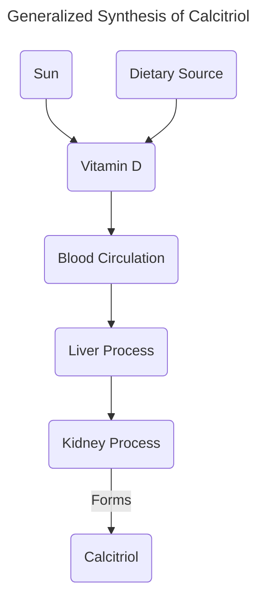

# Lecture 7 Body Structure

#### Learning Outcomes
- Understand basic bone structure/matrix
- Knowledge of the different bone cells
- To understand bone remodeling/turnover
    - Why it is important
    - How it is assessed using serum markers
- Develop a good understanding of serum calcium regulation by hormones
    - To describe how parathyroid hormone (PTH) regulates of serum Ca2+
    - To understand how vitamin D regulates serum Ca2+
- An understanding of osteoporosis

#### Basic Bone Structure
- Cortical Bone (Compact/Dense)
    - Makes up 80% of total bone mass
    - External Layer
    - 10% porous
- Cancelous Bone (Trabecular/Spongy)
    - Makes up 20% of total bone mass
    - Highly Porous, (50% ~ 90%)
    - Network of thin porous trabeculae in directions of stress
    - Provides a large bone surface for mineral exchange
        - 4 times more active than cortical bone

#### Bone Cells
###### Osteoblasts
Osteoblasts are the first of three main bone cells present in the body. The role it plays is the formation and mineralization of bone tissue. Osteoblasts facilitate the deposition of minerals on to the collagen matrix (calcium and phosphate).

The P1NP secreted by osteoblasts is released into the blood and by measuring this, it is possible to determine how active osteoblasts are in a human. In other words, P1NP concentrations in blood can tell us how active bone formation is in the body.

###### Osteoclasts
Osteoclasts are the second of three main bone cells present in the body. The role it plays is the resorption and breakdown of bone tissue. More specifically, they breakdown the mineralized matrix of bone, releasing minerals such as calcium and phosphate into the bloodstream.

###### Osteocyte
Osteocytes are the third of three main bone cells present in the body. They are embedded in the mineralized bone matrix. They are responsible for maintaining bone tissue by sensing mechanical stress and strain and then orchestrating signaling pathways to regulate bone remodeling.

Osteocytes in the bone matrix form a **canalicular network**. The canalicular network is made up of tiny, thread-like channels that connect individual osteocytes with each other and with blood vessels in the surrounding bone tissue. It allows for communication and nutrient exchange between osteocytes and helps in the maintenance of bone tissue.

Through the canalicular network, osteocytes can sense mechanical strains and stresses applied to the bone. They also play a role in coordinating bone remodeling by signaling other bone cells via the release of factors.
- TANKL increases osteoclast formation
- OPG decreases osteoclast activity
- Sclerostin deccreases osteoblast activity

Osteocytes are Mechano-Sensing Cells, which means that tey respond to loads in tissue. Note that this is also the cuase for bone loss in space.

#### Bone Remodelling/Turnover

Bone remodelling allows for a form of homeostasis to be applied to bones. There must be a balance between calcium and protein in the bones of our bodies. This is because, using extremist cases, if there is too much cacium and too little protein, the bones would be very brittle and easy to shatter. Similarly, with too much protein and too little calcium, the bones would be very 'bendy', like rubber.

While, bone remodelling maintains the structural integrity and toughness of bones in the body, it also allows for adaptation in the sense that bones can be restructured to have optimal shape in response to large loads over time. Additionally, it can repair damage to the skeleton while preventing accumulation of aged tissue.

In the 'worst-case' scenario, through bone remodelling, the body can supplies calcium and phosphorous for mineral homeostasis for organ function.

Bone remodelling occurs in a few simple steps:
1. The bone surface is activated
2. Osteoclast precursors are recruited to the activated site
3. Osteoclasts move to the site and start 'eating away' the bone while signalling Osteoblasts
4. Osteoblasts move to the site and start 'filling in' the cavity made by the Osteoclasts
5. The new mineralized bone is formed

#### Serum Calcium Regulation
Serum calcium refers to the amount of calcium present in the liquid portion of the blood. Calcium plays an extremely important role in bodily functions, and these include, but are no limited to:
- Contraction of muscles
- Regulates blood coagulation
- Maintains mechanical integrity of the skeleton

However, having too much or too little calcium is also a boon.
Hypocalcemia (having too little calcium) can lead to muscle spasms and seizures.
Hypercalcemia (Having too much calcium)can lead to nausea, osteoporosis and kidney failure.

###### Parathyroid Hormones (PTH)
Parathyroid hormone (PTH) is a hormone produced by the parathyroid glands and plays a crucial role in the regulation of calcium and phosphate levels in the body. Its primary functions include:
- Calcium Regulation
    - Stimulates the release of calcium from the bones, promoting bone resorption (breaking down bones to increase calcium levels in the body)
    - Enhances the reabsorption of calcium in the kidneys, reducing the excretion of calcium in urine
    - Indirectly promotes the absorption of calcium from the intestines by stimulating the production of calcitriol
- Phosphorous regulation
    - Increases the excretion of phosphate in urine

Note that when blood calcium is high PTH production is reduced.

###### Calcitriol
Calcitriol is the active form of vitamin D. It main role is to regulate the calcium and phosphorous levels in the body.

Calcitriol regulates calcium homeostasis by:
- Increasing intestinal calcium absorption if needed
- Increases renal reabsorption of calcium if needed
- Indirectly increases PTH production
- Signals receptors on bone cells to increase bone reabsorption and decrease bone formation

Calcitriol is suppressed by:
- High levels of Calcium
- High levels of Phosphorous

#### Osteoporosis
Oesteoporosis is a disease where the rods in the trabecular bones are disrupted, thin, weakened and or disconnected. Simply put, the trabecular bones would xhiit increased bone loss.

Note that osteoporosis involves having an excess of osteoclasts.

It can be caused by menopause (as menopause contributes heavilyt to enhanced bone loss). This is because estrogen acts on both osteoclasts and osteoblasts, and stimulates a decreases in bone resorption and increase in bone formation. However, as menopause would cause a drop in estrogen, there would be an increase in bone resorption and decrease in bone formation. Hence, women are more susceptible to osteoporosis.

Other factors that may influence the cause of osteoporosis are:
- Previous Fractures, a history of fractures increases the risk
- Lifestyle Factors:
    - Calcium Intake: Low calcium intake increases the risk
    - Smoking: Smoking contributes to bone loss

Preventive Measures:
Weight-bearing exercises with increasing load produce the best response to increase bone mass.
