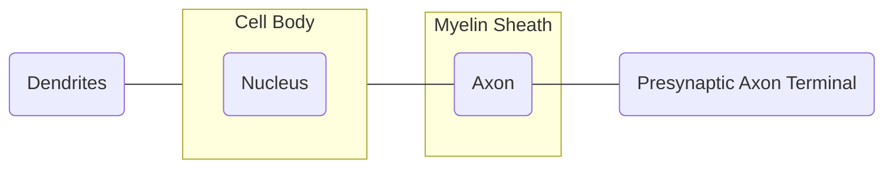
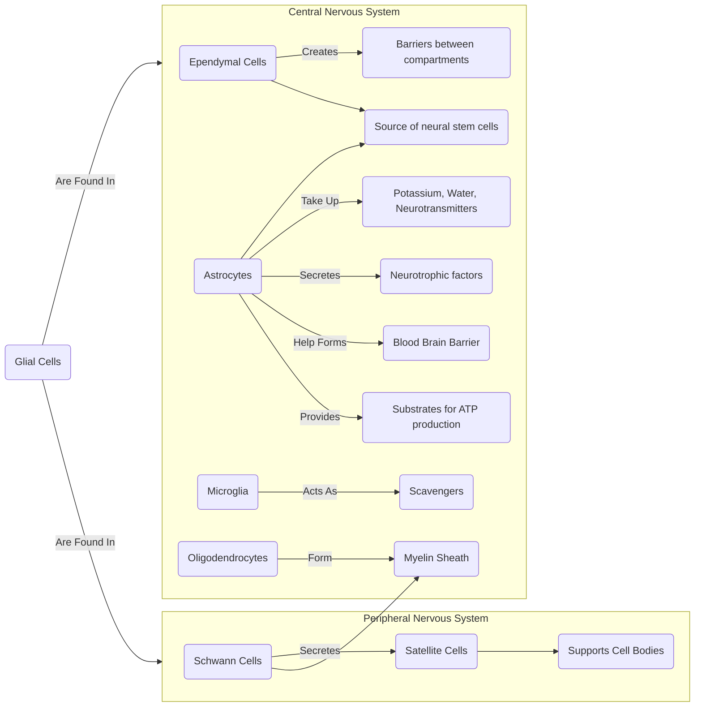

# Lecture 8 Nerves and Action Potential

#### Learning Outcomes
- Draw and label the main anatomical features of a neuron.
- Describe the basic functions associated with each anatomical feature of the neuron.
- Describe the roles of glial cells in supporting neuronal health and function.
- Describe the interrelationship of electrical, chemical and electrochemical gradients.
- Demonstrate an understanding of membrane potential and how it is generated.
- Describe the generation of a graded potential and an action potential, and key differences between the two.
- Understand the concept of summation and describe the differences between temporal and spatial summation.
- Define the terms threshold, depolarisation, repolarisation and hyperpolarisation, and understand the relationship between these terms and the activity of voltage-gated channels.
- Explain the refractory period and its impact on action potential generation and propagation.
- Draw a representative action potential trace.
- Identify the properties of an axon that can affect action potential conduction velocity.
- Describe the differences between continuous and saltatory propagation.

#### Anatomy of a Neuron

#### Basic Functions of a Neuron

Cell Body (Soma):
- Function: It is responsible for maintaining the metabolic and biochemical processes necessary for the neuron's survival and functioning.

Dendrites:
- Function: They play a crucial role in integrating incoming information and transmitting it toward the cell body.

Axon:
- Function: It carries nerve impulses away from the cell body to other neurons, muscles, or glands. It serves as a conduit for the transmission of electrical signals, ensuring the communication between different parts of the nervous system.

Axon Hillock:
- Function: The axon hillock is the region where the axon originates from the cell body. It is crucial in determining whether an action potential (nerve impulse) will be generated. It integrates the signals from dendrites and, if the threshold is reached, initiates the transmission of the action potential down the axon.

Myelin Sheath:
- Function: The myelin sheath is a fatty, insulating layer that surrounds and protects the axon. It also facilitates the rapid transmission of nerve impulses by preventing the dissipation of electrical signals. 

Axon Terminals (Terminal Boutons):
- Function: At the end of the axon, terminal boutons or axon terminals contain synaptic vesicles filled with neurotransmitters. When an action potential reaches the axon terminals, these vesicles release neurotransmitters into the synaptic cleft, facilitating communication with the next neuron or effector cell.

Synapse:
- Function: The synapse is the junction (space) between the axon terminals of one neuron and the dendrites or cell body of another neuron. Neurotransmitters released into the synapse transmit signals from one neuron to the next. This process is crucial for information transfer between neurons in neural circuits.

#### Gilial Cells

#### Ionic Gradients and Membrane Potentials
A gradient is the variation in concentration of molecules across a space.

###### Fluid Distribution
In the body:
- Intracellular fluid takes up 2/3 of the fluid in the body
- Extracellular fluid takes up 1/3 of the fluid in the body
    - It  is composed of Interstitial FLuid and Plasma
Note that it is the cell membrane that divides fluids into compartments.

###### Chemical(Ionic) Gradient
Because the body fluids are separated into compartments, there exists a concentration gradent between the Intracellular Fluid and Extra Cellular Fluid. This is because the cell membrane restricts the movement of ions between compartments.

Generally:
- Potassium is mostly found in intracellular fluid
- Sodium is found in extracelllar fluid

###### Electrochemical Gradient
Due to the existence of the chemical gradient and properties of the cell membrane, this results in an electrical gradient. This is because, more K+ leaves the cell than Na+ enters through leak channels (basically permanently open gates on the cell membrane), resultantly creating an electrical gradient (inner surface of the membrane has a more negative charge relative to the outer surface).

Thus the net effect (combination) of both the electrical and chemical forces (gradients) across the membrane is called the electrochemical gradient.

#### Gated Channels
A gated channel ia basically a 'gate' that appears on the cell membrane that allows teh movement of ions into and out of the cell.

At rest, most gated channels are closed and they rapidly open in response to a chemical (ligand), electrical(voltage) or mechanical stimulus.

voltage gated - gate that opens in response to electrical stimulus
ligand gated - gate that opens in response to chemical stimulus
stress activated fate - mechanical stimulus

#### Graded Potential
Graded potential is a small change in the electrical potential of a cell in response to a stimulus. It can be imagined as a water drop in still water, where the outer ripples get much weaker (but in this case, electricity). The measure of the strength of a graded potential in milliVolts.

A grade potential can be produced by any stimulus that can open a gated channel it is classed as either:
1. Depolarization --> more positive potential
2. Hyperpolarization --> more negative potential

Note that repolarization is the return to resting potential

#### Action potential
An action potential is a brief and rapid change in the membrane potential of a cell. For an action potential to occur, the stimulus must generate potential that must travel through the cell body and approach the axon hillock(trigger zone).

Action potentials adhere to the 'one-or-non' principle. This basically means that there will either be a reaction or no reaction at all, another wya of looking at it is the ouut put will either be a 1 or 0. "Do or do not, there is no try".

Note that the generated 'potential'/'polarization' is basically electrical current.

The axon hillock acts as a 'filter' where potentials that are too weak in strength will not be able to generate an action potential. In more professional terms, if the potential does not meet the threshold, an action potential will not be generated.

A method used to generate a action potential is called summation, which can be split into two types:
- Temporal
    - This type of summation is when one source of stimulus creates the potential more than once within a short timeframe
- Spatial
    - This type of summation is when two or more sources of stimulus create the potential together at the same time

The threshold is a polarization that is large enough to trigger the opening of the voltage gated Na+ channels.

The stages of an action potential is as follows:
1. depolarization (increase in membrane potential) to threshold
2. Activation of voltage gated Na+ channels
3. Rapid depolarization
4. Inactivation of Na+ channels
5. Opening of K+ channels
6. Return to normal permeability

It is basically like an simple electrical circuit, where a current is sent to a lightbulb, and when the current is turned off, the light turns off. In this case, the 'current' would increase the membrane potential until it hits the threshold (the current is higher than the resistance), then increased membrane potential would open the Na+ channels (turning on the lightbulb). Afterwards, the 'current' wold die down and the gates would clolse (lightbulb turns off).

#### Refractory Period
This is the period of time when a neuron does not respond normally to depolarizing stimulus.

###### Absolute Refractory Period
All Na+ channels are either open or close, but cannot be changed during this time

###### Relative Refractory Period
All Na+ channels resume resting state and can be activated, but need a larger than normal stimulus

#### Role of Myeline
The myeline acts like the insulation that coats a wire. It prevents electrical signals from interacting with the external environment (electrical leakage), while also protecting the axon.

#### Classification of Axons
Having a larger diameter allows for faster conduction. Similarly, being myelinated also allows for faster conduction.

1. Type A
    - Myelinated with a large diameter
    - Reserved for sensory and motor signalling
2. Type B
    - Myelinated with a smaller diameter
3. Type C
    - Unyelinated wih a small diameter