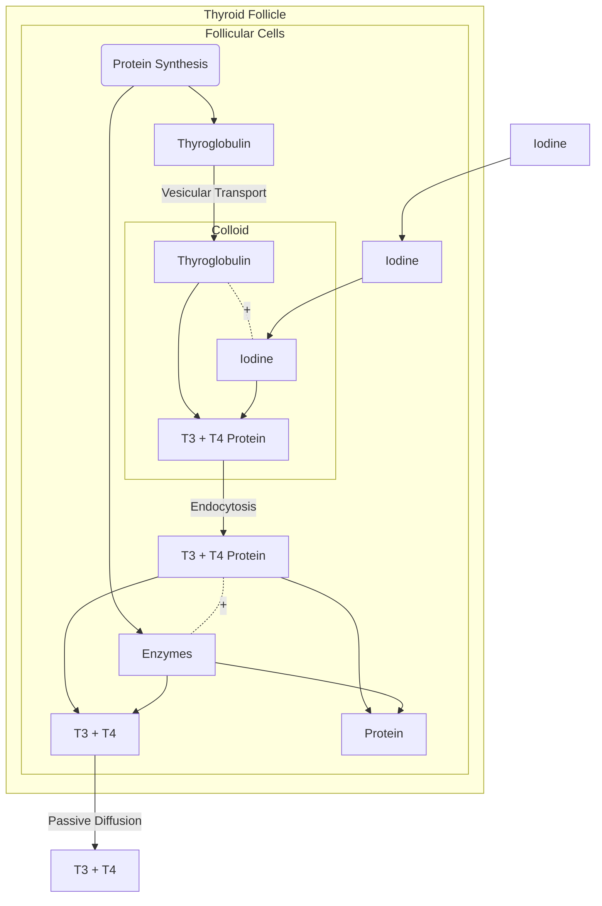
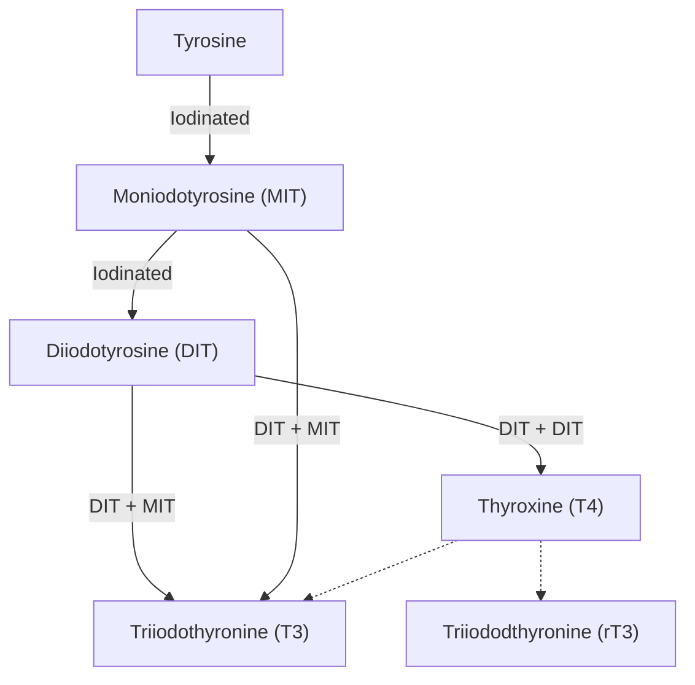
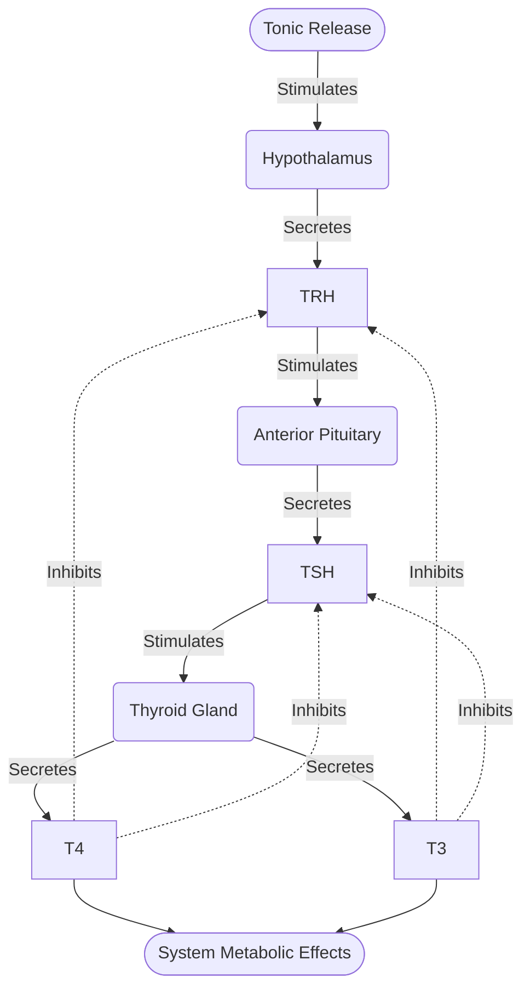

# Lecture 5 Thyroid Function and Control

#### Learning Outcomes
- The thyroid axis and thyroid gland anatomy.
- Synthesis of thyroid hormones T3 and T4.
- Stimuli for hormone secretion.
- Actions of thyroid hormones.
- Hypothyroidism
- Hyperthyroidism

#### Thyroid Gland Anatomy
The thyroid gland is located just under the vocal chords.

It is made up many parts
- Parafollicular cells (Also called C cells)
- Blood Capillary
- Capsule of Connctive Tissue
- Thyroid Follicle
    - Follicular cells (Periphery)
    - Colloid (is a Glycoprotein) (Lumen)

#### Thyroid Axis

#### Synthesis of Thyroid Hormones
Follicular cells are responsible for the synthesis of T3 and T4 thyroid hormones. These hormones are called Thyroxine (T4) and Triiodothyronine (T3).

More specifically, follicular cells, produce Thyroxine (T4) as the major hormone. Thyroxine is then released into circulation to affect target tissues, and when the action is complete, T4 converted into T3, hence Thyroxine is a precursor.

Note that T3 is the biolocially active hormone. This means that it is the more potent and active form of thyroid hormone that directly influences cellular metabolism.

The Colloid is a storage structure that contains a protein called Thyroglobulin. Thyroglobulin is **precursor** of both the T3 and T4 hormones, and it undergoes an enzymatic process to release T3 and T4 as needed.

Note that many steps of this pathway is regulated by TSH (which is secreted by the anterior pituitary gland). This process includes:
- Thyrolobulin Synthesis
- Iodine Trapping
- Iodine Diffusion
- Thyroid Peroxidase
- Coupling
- Endocytosis
- Lysosome Fusion
- Thyroid Hormone Secretion

The following is a flowchart to show the process of synthesis and release of T3 and T4 Hormones.

The following is a simplified flowchart to show the synthesis of Thyroid Hormones from Tyrosine in the Colloid (Thyroglobulin has been omitted for simplicity).

#### Stimuli for Hormone Secretion
The main stimuli for Thyroid Hormone Secretion are:
- Cold Temperatures
- Stress and Illness
- Low levels of Thyroid Hormones
- Low Metabolic Rate
- TRH
- TSH

###### Regulation of Thyroid Hormones

#### Actions of Thyroid Hormones
Thyroid Hormones affect nearly every organ in the body. This includes:
- Increase Mitochondrial Activity
- Increase in Glucose Oxidation in Target Cells
- Increase Basal Metabolic Rate
- Increase Heat Production
- Increase Normal Growth and Development
- Increase Cardiac Function

#### Thyroidism
###### Hyperthyroidism
Hyperthyroidism occurs when where a person's thyroid gland secretes **too much** hormones. This can cause drastic changes in metabolism, the nervous system and the heart.
Common Symptoms are:
- Increase oxygen consumption rate and metabolic heat production
- Rapid Heartbeat
- Muscle Tremor
- Increase Protein Catabolism (and possible muscle weakness)

A common disease is Grave's Disease.
- Thyroid Gland Tumors
- Results in hypersecretion of T3 and T4
- Negative feedback 'completely shuts down' Anterior Pituitary (TSH) and Hypothalamus (TRH)

###### Hypothyroidism
Hypothyroidism occurs when where a person's thyroid gland secretes **too little** hormones. Hypothyroidism is split into 3 types:
- Primary Hypothyroidism
    - The body does not produce enough **Thyroid Hormones** (can be caused by iodine deficiency).
- Secondary Hypothyroidism
    - The body does not produce enough **TSH** (can be caused by a tumor in the anterior pituitary).
- Tertiary Hypothyroidism
    - Hypothalamus is not producing enough **TRH**.

Common Symptoms are:
- Slow oxygen consumption and metabolic rate
- Decreased protein synthesis
- Slow speech anf though process
- Slow heartbeat (Bradycardio)

A common disease is Goiter:
- Iodine deficiency
- Low levels of T3 and T4
- Thyroid gland is enlarged
